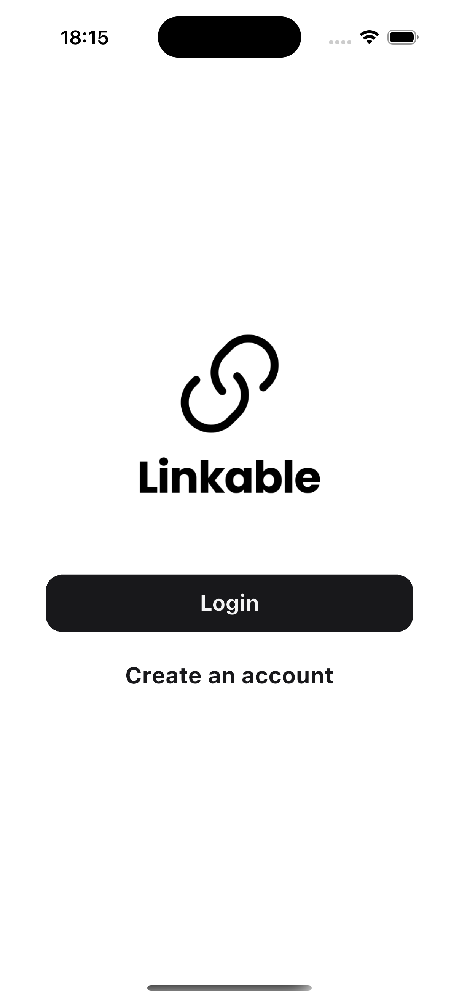
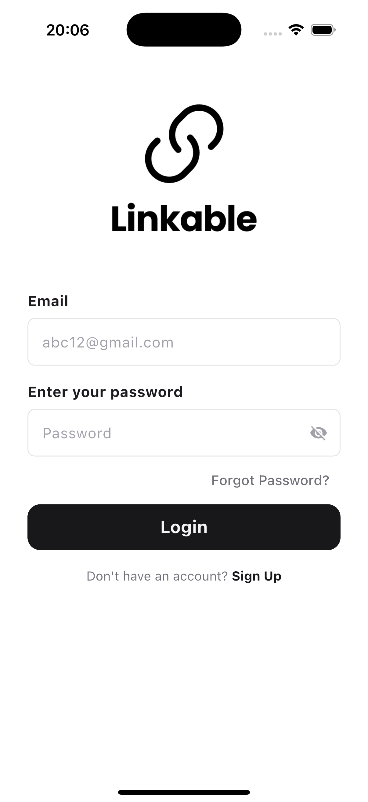
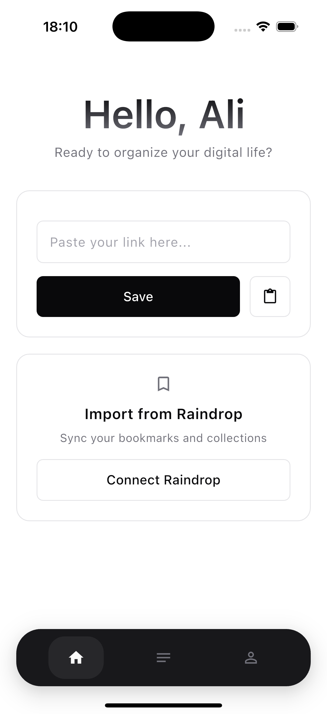
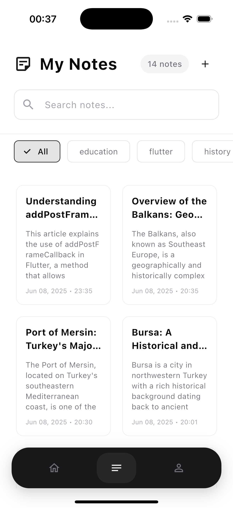
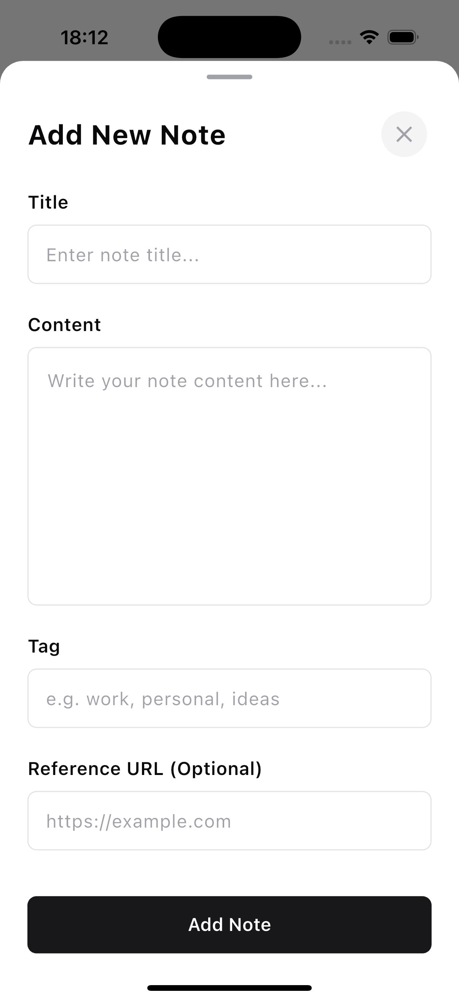
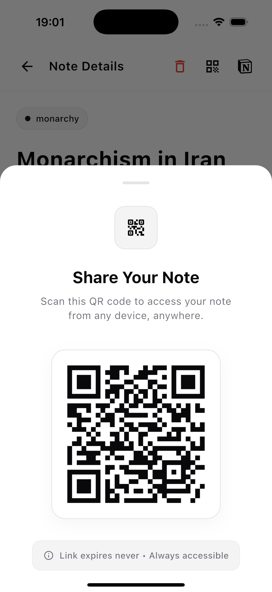
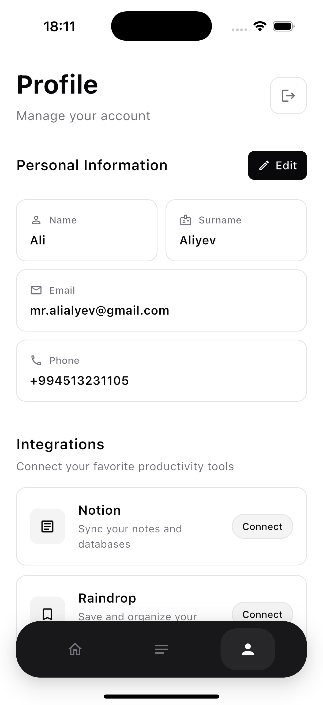

# 🔗 Linkable - Smart Link & Note Assistant

[](https://flutter.dev/)
[](https://firebase.google.com/)
[]()


## 📱 Screenshots

<div align="center">
  
  
  
  
</div>

<div align="center">
  
  
  
</div>

## 🌟 Overview

Linkable is a Smart Link & Note Assistant built for a hackathon that streamlines how users manage and share web content. The application combines AI-powered content processing with intuitive organization features to create a seamless experience for saving, organizing, and sharing web links and notes.

## 📱 App Flow

### 🔗 Smart Link Processing Flow
```
1. Link Input → 2. AI Processing → 3. Content Review → 4. Save & Organize
```

**Step 1: Link Input**
- **Manual Link Entry**: Paste any URL directly into the app
- **Raindrop Integration**: Import links from your Raindrop collection
- **Custom Tagging**: Add personalized tags during input

**Step 2: AI Processing** 
- **Web Scraping**: Extract main content, title, and host information
- **OpenAI Analysis**: Generate clean titles, concise summaries, and smart tag suggestions
- **Content Optimization**: Transform raw web content into organized notes

**Step 3: Content Review**
- **Bottom Sheet Interface**: Review AI-generated content
- **Edit & Customize**: Modify titles, tags, or summaries as needed
- **Preview**: See final note before saving

**Step 4: Save & Organize**
- **Smart Storage**: Save with AI-enhanced metadata
- **Auto-Categorization**: Organize by tags and host domains
- **Instant Search**: Content becomes immediately searchable

### 🔍 Search & Discovery Flow
```
Search Input → Filter Options → AI Semantic Search → Results Display
```

**Search Methods**:
- **Tag-Based Filtering**: Quick access through custom and AI-suggested tags
- **Host-Based Filtering**: Organize by website domains  
- **AI-Powered Semantic Search**: Find content using natural language queries
- **Smart Suggestions**: Get recommendations based on search patterns

### 📤 Sharing & Collaboration Flow
```
Select Note → Choose Sharing Method → Generate Link/Code → Share
```

**Sharing Options**:
- **User-to-User Sharing**: Share notes directly via username
- **TinyURL Generation**: Create shortened links for easy sharing
- **QR Code Creation**: Generate QR codes for instant access
- **External Export**: Share to other apps or save to Notion

### 🔄 Complete User Journey
```
Welcome → Login/Signup → Add First Link → AI Processing → Review & Edit → Save → Search & Manage → Share & Export
```

1. **Onboarding**: Welcome screen and user authentication
2. **First Link**: Add your first URL (manual or from Raindrop)
3. **AI Magic**: Watch AI extract and enhance content automatically
4. **Personalization**: Review and customize the AI suggestions
5. **Organization**: Save with smart tags and categories
6. **Management**: Search, filter, and organize your growing collection
7. **Collaboration**: Share notes with others or export to external services

## ✨ Key Features

### 🤖 AI-Enhanced Content Management
- **Intelligent Scraping**: Extract main content, titles, and host information
- **OpenAI Integration**: Generate clean, AI-optimized titles and summaries
- **Smart Tag Suggestions**: AI-powered tag recommendations
- **Content Optimization**: Transform raw web content into organized notes

### 🔍 Advanced Search & Organization
- **Tag-Based Filtering**: Quick access through custom and AI-suggested tags
- **Host-Based Filtering**: Organize by website domains
- **AI-Powered Semantic Search**: Find content using natural language queries
- **Intelligent Categorization**: Automatic content organization

### 📤 Sharing & Collaboration
- **User-to-User Sharing**: Share notes directly via username (coming soon)
- **TinyURL Generation**: Create shortened links for easy sharing (coming soon)
- **QR Code Creation**: Generate QR codes for instant access
- **Cross-Platform Sharing**: Export to external applications (coming soon)

### 🔗 External Integrations
- **Notion Export**: Save notes directly to your Notion workspace (coming soon)
- **Raindrop Import**: Import existing bookmarks seamlessly (coming soon)
- **Firebase Sync**: Real-time data synchronization across devices
- **Cloud Storage**: Secure backup and retrieval

### 📱 User Experience
- **Modern UI/UX**: Clean, intuitive interface design
- **Bottom Sheet Interface**: Seamless content review and editing
- **Real-time Preview**: Live content processing feedback
- **Offline Support**: Access saved content without internet (coming soon)

---

<div align="center">
  <strong>Built with Flutter • Powered by AI • Made for Hackathon</strong>
</div>